

# 全双工语音 × 具身执行双 Agent 系统

## Voice Agent + Arm Agent：从串行 Pipeline 到异步双 Agent 的设计演进

---
transition: slide-up
title: "传统串行语音 Pipeline"
---

传统方案：串行语音 Pipeline

VAD → STT → LLM → TTS，严格串行执行

  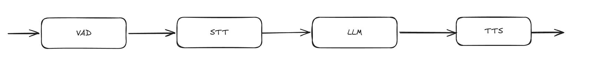

延迟叠加

一轮交互延迟 ≈ 四级延迟之和

无法插话

系统说话时，用户只能等待

资源闲置

任意时刻只有一个组件在工作

---
transition: slide-up
title: "改进一：Buffer"
---

改进 ① —— Buffer

环形 buffer：动态记录截至当前、往前 1s 的音频片段

  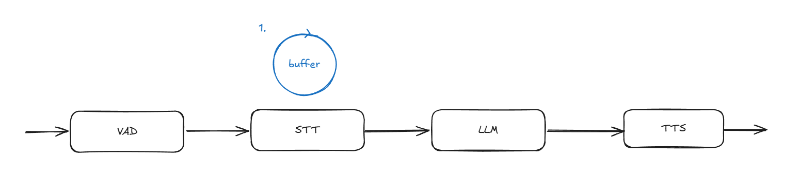

防止吞字

VAD 检测到说话时句首已被吃掉；buffer 让 STT 从开口前 1s 开始识别，不丢字

环形结构

只保留最近 1s 的滚动窗口，持续覆写，内存恒定

---
transition: slide-up
title: "改进二：打断机制（说话阶段）"
---

改进 ② —— 打断机制（一）：说话阶段被打断

说到一半可以随时打断，上下文自动重组

  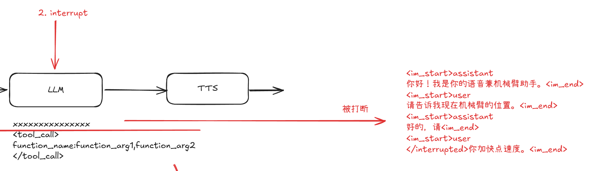

打断回写：被打断的 assistant 消息以 <code>&lt;/interrupted&gt;</code> 标记截断点、原样保留在上下文中，用户新输入自然接续其后，上下文保持连贯。

---
transition: slide-up
title: "改进二：打断机制（tool_call 阶段）"
---

改进 ② —— 打断机制（二）：tool_call 阶段被打断

工具调用生成期间用户插话，两条线索并行推进

  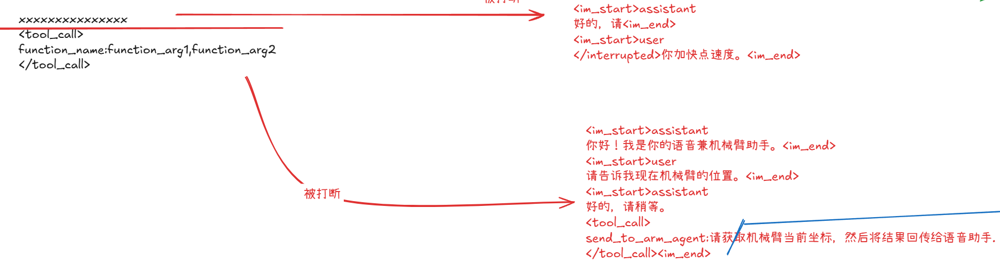

核心观察：tool_call 生成阶段对用户天然静默，用户打断可与当前工具调用并行处理，互不阻塞。

---
transition: slide-up
title: "改进二：打断机制（边听边想）"
---

改进 ② —— 打断机制（三）：边听边想

goroutine 并行处理，双双就绪后再做下一步推理

  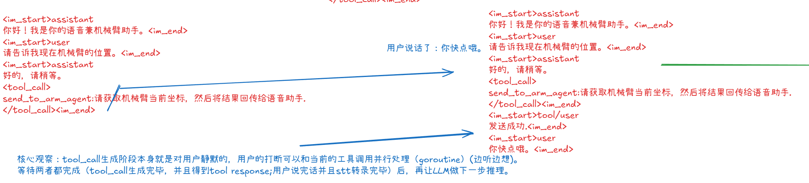

双双就绪再推理：等待 tool_call 生成完毕并得到 tool response、且用户说完话 STT 转录完毕后，再让 LLM 做下一步推理——一次推理同时看到工具结果与新输入。

---
transition: slide-up
title: "改进三：异步 Agent 系统"
---

改进 ③ —— 异步双 Agent 系统

状态栏的引入：本质是一个生产者–消费者问题

  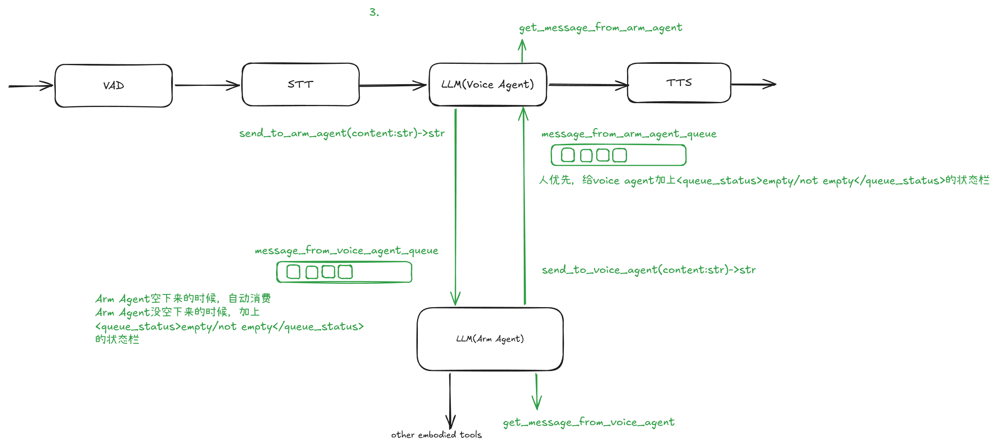

双向消息队列解耦：<code>send_to_xxx_agent</code> 生产、<code>get_message_from_xxx_agent</code> 消费，两个 Agent 异步协作、互不阻塞。

人优先：后台 Agent 空闲时自动消费队列；忙碌时通过 <code>&lt;queue_status&gt;</code> 状态栏感知未读消息，主动消费，绝不插队打断当前推理。

---
transition: slide-up
title: "上下文工程（一）：状态栏统一"
---

上下文工程 ① —— 状态栏统一为独立 user 消息

异步 Agent 加入后，上下文如何保持连贯、状态可感知

  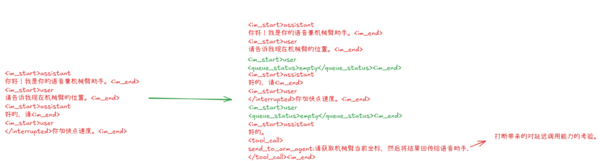

<code>&lt;queue_status&gt;</code> 统一改动

状态栏统一以独立的 user 消息注入，不再拼接进用户文本

延迟调用能力的考验

打断引入后，工具调用可延迟到双双就绪后再触发推理

---
transition: slide-up
title: "上下文工程（二）：固定排序"
---

上下文工程 ② —— 多轮全链路与固定排序

tool response → user input → 状态栏，上下文始终自洽

  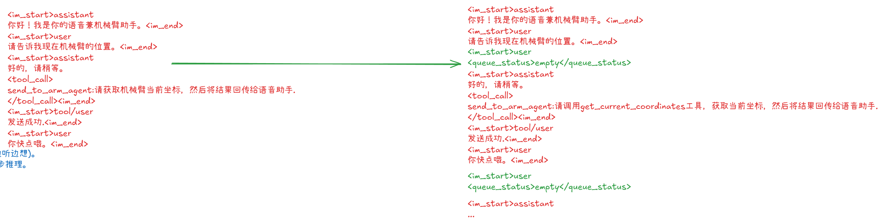

排序约定：tool response、user input、状态栏三者同时存在时，固定顺序为 tool response → user input → 状态栏；工具结果以单条 role=tool 消息写回（chat template 渲染进 user 的 &lt;tool_response&gt; 块），多轮之后队列状态与上下文始终自洽。

---
transition: slide-up
title: "训练数据集全景"
---

训练数据集全景结构

异步双 Agent 训练数据集 · 2,900 条

  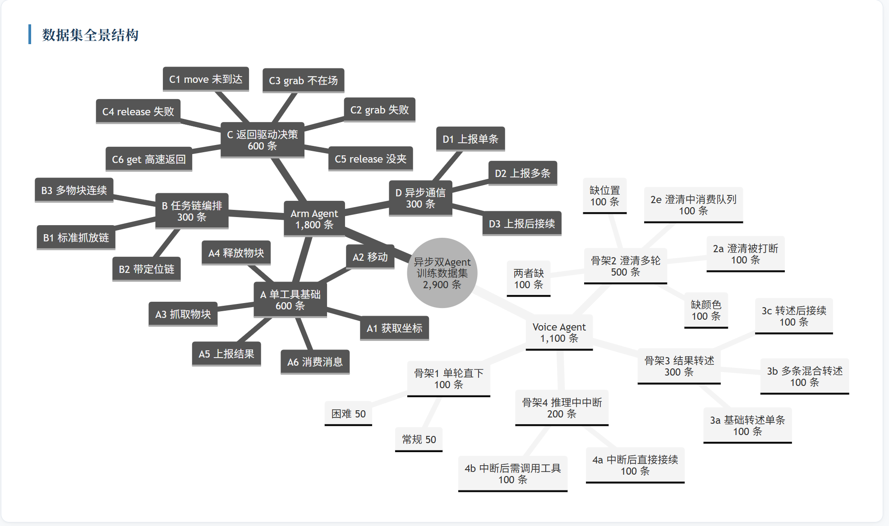

---
transition: slide-up
title: "Voice Agent 训练曲线"
---

Voice Agent · SFT 训练曲线

Qwen3-4B + QLoRA · 训练 loss 收敛至 ≈ 0.057，held-out 验证 loss 0.243 → 0.156

  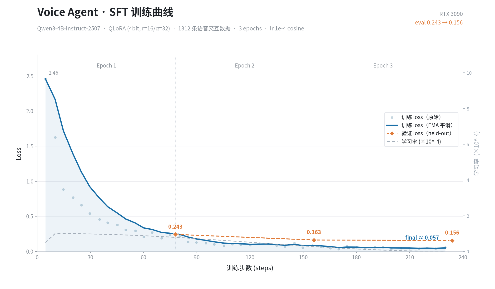

---
layout: center
class: text-center
transition: fade
title: "训练中"
---

Still training now…

Voice Agent ready · Arm Agent SFT still in progress

---
transition: slide-up
title: "具身工具 API 网关"
---

具身工具 REST 网关（:8000）

6 个协议工具对外暴露为 RESTful API：同步阻塞调用，联调无需轮询

| 接口 | 方法 | 说明 |
| --- | --- | --- |
| `get_current_coordinates` | GET | 查当前坐标（低速 / 高速两种返回话术） |
| `move_to_coordinates` | POST | 移动到 x,y,z，内部误差校验，未达标如实报误差 |
| `grab_the_block` | POST | 视觉观察 → 夹取，camera2 第三视角判定成败 |
| `release_the_block` | POST | 交叉验证是否夹持，释放失败则请人介入 |
| `send_to_voice_agent` | POST | 生产消息进 arm→voice 队列（进度 / 完成 / 求助） |
| `get_message_from_voice_agent` | POST | 排空 voice→arm 队列，一次性取回全部新指令 |

统一约定：所有接口返回 <code>{code, result, error}</code> 三段式，工具原始字符串经 <code>result</code> 逐字透传；HTTP 200 / 400 / 500 对应网关成功 / 参数错误 / 内部异常。本网关与语音网关（:8001）对接同一个队列后端，两条 FIFO 队列即双 Agent 的生产–消费通道。

---
transition: slide-up
title: "演示：具身工具 API 联调"
---

演示 —— 具身工具 API 网关联调

REST 网关搭建完成后的端到端真机演示

  <video src="./embodied_tools.mp4" controls muted style="max-width: 76%; border: 1px solid #e5e7eb; border-radius: 10px; box-shadow: 0 4px 16px rgba(0,0,0,0.08);" />

---
transition: slide-up
title: "团队协作"
---

团队协作 —— GitHub 协同开发

14 位贡献者 · 分支并行开发 · PR 合入主干

  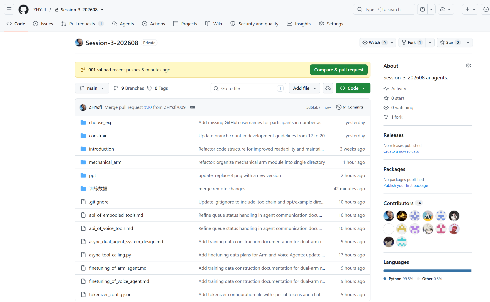

---
layout: center
class: text-center
transition: fade
title: "系统即将就绪"
---

The full system goes live tonight…

---
layout: center
transition: fade
class: text-center
title: "谢谢"
---

# 谢谢聆听

全双工语音 × 具身执行双 Agent 系统 · 设计演进

