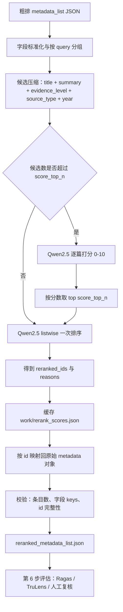

# 方案 2 架构：本地 Ollama + Qwen2.5 listwise 精排

## 1. 方案概述

本方案不调用任何付费 API，在本地运行 Ollama 服务加载 Qwen2.5 模型，对第 4 步输出的粗排 `metadata_list` 做二次精排。精排只改变候选论文的顺序，最终输出与粗排文件保持相同的字段和结构。

## 2. 总体架构

## 3. 组件说明

| 组件 | 职责 | 实现 |
|---|---|---|
| 输入层 | 读取粗排 `metadata_list`，自动识别列表所在的 JSON 键 | Python 标准库 `json` |
| 预处理层 | 字段 fallback、按 query 分组、长文本截断、内部 id 映射 | `rerank_listwise.py` |
| 排序引擎 | listwise 排序；候选过多时先逐篇打分再 listwise 终排 | 调用本地模型 |
| 本地模型运行时 | 提供 OpenAI 兼容的 `/v1/chat/completions` 接口 | Ollama，`localhost:11434` |
| 缓存层 | 保存逐篇打分结果，中断后不重复推理 | `work/rerank_scores.json` |
| 输出层 | 生成同字段、同结构、仅顺序变化的 JSON | `reranked_metadata_list.json` |
| 校验层 | 保证条目数不变、字段不变、id 不缺失 | 脚本内置 `validate()` |

## 4. 排序流程细节

1. 每个 query 的候选数不超过 `score_top_n` 时，直接做一次 listwise：把问题和候选列表整体交给 Qwen2.5，要求输出排序后的 `reranked_ids` 和每篇一句话 `reasons`。
2. 候选数超过 `score_top_n` 时，先对每篇单独打 0-10 分，取分数最高的 `score_top_n` 篇，再对这批做 listwise 终排；剩余候选按粗排顺序跟在后面。
3. 内部使用 `paper_序号` 作为排序 key，避免原始 id 重复或字段缺失导致映射失败。
4. 最终文件按新 id 顺序取回原始 metadata 对象，字段不做任何增删改。

## 5. 技术栈与硬件需求

| 项目 | 要求 |
|---|---|
| 运行环境 | Windows / Linux / macOS，Python 3.8+ |
| Python 依赖 | 无，仅标准库 |
| 本地服务 | Ollama，默认端口 11434 |
| 推荐模型 | `qwen2.5:7b`；无 GPU 可用 `qwen2.5:3b`；有 GPU 可上 `qwen2.5:14b` 或更大 |
| 显存 | 7B 量化约 5-6 GB；3B 量化约 2-3 GB |
| 纯 CPU | 7B 需约 8 GB 可用内存，速度较慢 |

## 6. 成本与性能估算

| 项目 | 估算 |
|---|---|
| API / token 费用 | 0 |
| 首次部署 | 下载 Ollama 和模型，需要一次性联网 |
| 运行速度 | 3B CPU 约每篇 5-15 秒；7B CPU 约每篇 15-30 秒；GPU 明显更快 |
| 50 候选单个问题 | 逐篇打分约 10-15 分钟，加一次 listwise 约 2 分钟 |
| 数据安全 | 论文文本不离开本机 |

## 7. 与其他方案对比

| 维度 | 方案 2 本地 Qwen | 方案 1 付费/免费 API | 方案 3 bge-reranker | 方案 4 纯规则打分 |
|---|---|---|---|---|
| 金钱成本 | 0，需自备硬件 | 按 token 计费，免费额度可先跑通 | 0，需下载模型 | 0 |
| 语义相关性 | 中 | 高 | 中，只算相关性 | 无，靠粗排分 |
| 证据等级与时效性理解 | 中 | 高 | 无 | 可显式加权 |
| 排序稳定性 | 小模型弱于大模型 | 高 | 高 | 高 |
| 速度 | 慢，受本机硬件限制 | 快，受 API 限流影响 | 快 | 最快 |
| 数据隐私 | 数据不出本机 | 数据发送到模型服务商 | 数据不出本机 | 数据不出本机 |
| 部署复杂度 | 需装 Ollama 并拉模型 | 只需配 API key | 需装 torch 并下载模型 | 无需安装 |
| 可解释性 | 有每篇 reason | 有每篇 reason | 只有分数 | 有可解释的加权规则 |
| 适合场景 | 无预算、数据敏感、需要本地演示 | 排序质量优先、预算允许 | 大候选初筛、速度优先 | baseline、零依赖演示 |

## 8. 风险与注意事项

- 本地小模型对复杂证据等级判断可能不如付费大模型，正式演示前建议抽样人工检查 Top 10-20。
- 模型偶尔会输出不规范的 JSON，脚本已做容错解析；若失败率高，可换更大模型或降低单次候选数。
- CPU 推理耗时明显，建议先用 1 个 query 试跑，再全量执行。
- 排序结果只用于项目演示，不作为真实诊疗依据。
