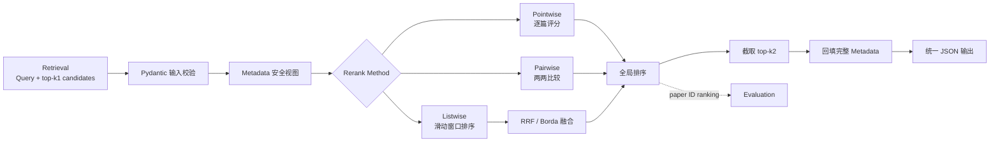
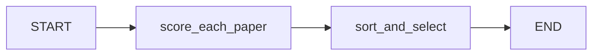
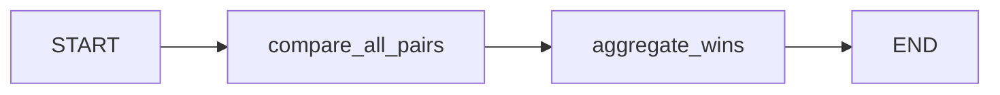
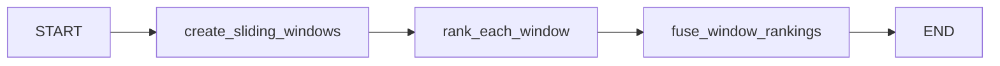
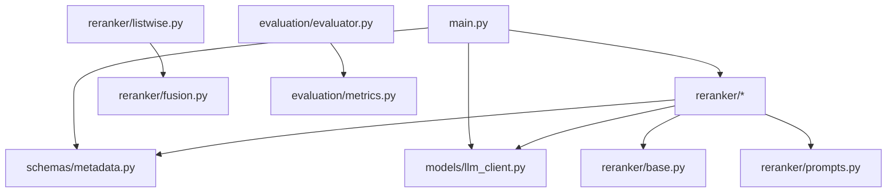

# Rerank Agent 架构说明

## 1. 模块定位

Rerank Agent 是论文检索流程的第五步。它不负责论文抓取、metadata 构建或 Retrieval，只处理上游 Retrieval 输出的候选集合：

```text
Retrieval 输出：Query + top-k1 Metadata
                     ↓
               Rerank Agent
                     ↓
Rerank 输出：排序后的 top-k2 完整 Metadata
```

`top_k1` 和 `top_k2` 都由调用方动态传入，并满足：

```text
1 <= top_k2 <= top_k1 <= candidates 数量
```

## 2. 总体架构



系统分为六个逻辑层：

1. **入口层**：读取配置和输入，选择排序方法。
2. **Schema 层**：校验 Metadata、候选 ID 和 k 值。
3. **Reranker 层**：使用 LangGraph 编排三种排序工作流。
4. **LLM 适配层**：统一 OpenAI、Qwen、兼容接口和离线 Mock 调用。
5. **结果组装层**：根据论文 ID 回填完整 Metadata 并返回 top-k2。
6. **Evaluation 层**：根据预测 ID 顺序和人工标注计算检索指标。

## 3. 数据流与安全边界

完整 Metadata 仅在程序内部流转：

```python
class Metadata:
    title: str | None
    year: str | None
    source_type: str | None
    id: str | None
    text_summary: str | None
    text: str | None
    image_summary: list[str] | None
    image_base_64: list[str] | None
    evidence_level: str | None
    last_retrieved_at: str | None
```

发送给 LLM 前，`Metadata.llm_view()` 会创建允许字段的安全视图：

```text
发送：id、title、year、source_type、text_summary、image_summary、evidence_level

不发送：text、image_base_64、last_retrieved_at
```

这里使用允许列表，而不是在每个 prompt 中临时删除字段。这样新增 Metadata 字段时不会自动泄漏给模型。

LLM 只返回论文 ID、分数或局部顺序。完成排序后，入口层根据 ID 从原候选集合中取回完整 Metadata。因此，最终输出可以包含正文等原始字段，但这些字段从未进入 LLM 上下文。

## 4. 统一 Reranker 接口

三个实现都继承 `BaseReranker`：

```python
rerank(
    query: str,
    candidates: list[Metadata],
    top_k2: int,
) -> list[dict]
```

内部统一结果：

```json
[
  {
    "id": "paper_001",
    "rank": 1,
    "score": 9.5,
    "reason": "..."
  }
]
```

CLI 再将其组装为对外输出：

```json
{
  "method": "pointwise",
  "top_k2": 10,
  "results": [
    {
      "metadata": {"id": "paper_001", "title": "..."},
      "rank": 1,
      "score": 9.5,
      "reason": "..."
    }
  ]
}
```

## 5. 三种 LangGraph 工作流

### 5.1 Pointwise



处理过程：

1. 每篇候选论文单独构造 prompt。
2. LLM 返回 `paper_id / score / reason`。
3. Pydantic 校验分数必须在 0–10 之间，并检查返回 ID 与当前论文一致。
4. 按分数降序排列，同分保留 Retrieval 的原始顺序。
5. 截取 top-k2。

LLM 调用次数为 `k1`，时间和调用成本近似为 `O(k1)`。

### 5.2 Pairwise



处理过程：

1. 使用 combinations 生成所有候选对。
2. LLM 必须从 Paper A 和 Paper B 的 ID 中选择一个 winner。
3. 统计每篇论文的获胜次数。
4. 使用 Win Count 形成全局排序。
5. 将胜率映射为 0–10 分并截取 top-k2。

LLM 调用次数为：

```text
k1 × (k1 - 1) / 2
```

该方法相对判断直接，但成本为 `O(k1²)`，较大的 k1 应谨慎使用。

### 5.3 Listwise



处理过程：

1. 根据 `window_size` 和 `stride` 创建滑动窗口。
2. 自动调整最后一个窗口的起点，保证所有候选至少出现一次。
3. LLM 对每个窗口中的全部论文直接排序。
4. 校验返回结果包含窗口内所有 ID，且每个 ID 只出现一次。
5. 使用 RRF 或 Borda 融合各窗口局部顺序。
6. 将融合分数归一化到 0–10 并截取 top-k2。

必须满足：

```text
window_size > 0
0 < stride <= window_size
```

默认使用 RRF：

```text
RRF(document) = Σ 1 / (rrf_k + rank_in_window)
```

Listwise 避免一次将全部候选发送给模型，适用于 k1 较大的场景。

## 6. LLM 适配层

业务排序代码只依赖统一接口：

```python
llm_client.complete_json(prompt, ResponseModel)
```

适配层负责：

- 根据配置选择 `mock / openai / qwen / compatible`。
- 从指定环境变量读取 API Key，配置文件中不保存密钥。
- 请求严格 JSON 输出。
- 从可能包含 Markdown 围栏的回复中提取 JSON。
- 使用对应 Pydantic ResponseModel 校验字段和类型。
- 在结构化输出无效时附带 schema 自动重试。

默认 Mock provider 是确定性的离线词法打分器，仅用于演示、开发和 CI，不代表生产排序质量。

## 7. Evaluation 架构

Evaluation 与具体 Reranker 解耦，只依赖最终论文 ID 顺序：

```text
predicted ranking + ground truth relevance
                       ↓
   Precision@K / Recall@K / MRR / NDCG@K
```

其中 Precision、Recall 和 MRR 将 `relevance > 0` 视为相关；NDCG 保留 0–3 等分级相关性信息。

## 8. 项目文件结构

```text
reranker_agent/
├── main.py                       # CLI 入口、配置读取、结果组装
├── config.yaml                   # LLM 与 reranker 默认配置
├── requirements.txt              # Python 运行依赖
├── README.md                     # 安装、运行和接口说明
├── ARCHITECTURE.md               # 本架构说明
├── .gitignore                    # 排除虚拟环境、缓存、密钥和输出
│
├── schemas/
│   ├── __init__.py
│   └── metadata.py               # Metadata、RerankRequest、ID 规范化
│
├── models/
│   ├── __init__.py
│   └── llm_client.py             # LLM 抽象、厂商适配、JSON 解析
│
├── reranker/
│   ├── __init__.py
│   ├── base.py                   # BaseReranker 与统一结果结构
│   ├── pointwise.py              # Pointwise LangGraph
│   ├── pairwise.py               # Pairwise LangGraph + Win Count
│   ├── listwise.py               # Sliding-window Listwise LangGraph
│   ├── fusion.py                 # RRF、Borda 和分数归一化
│   └── prompts.py                # 三种严格 JSON prompt
│
├── evaluation/
│   ├── __init__.py
│   ├── metrics.py                # Precision、Recall、MRR、NDCG
│   └── evaluator.py              # 评估统一入口
│
├── data/
│   └── example_candidates.json   # 可直接运行的输入样例
│
└── tests/
    ├── __init__.py
    └── test_reranker.py          # 工作流、指标和字段安全测试
```

`.venv/`、`__pycache__/`、`.env`、日志和本地输出目录不会进入 Git。

## 9. 主要依赖方向



依赖方向保持单向：Schema 和 LLM Client 不依赖具体排序策略；Evaluation 不依赖 LLM；三种 Reranker 之间互不依赖。

## 10. 扩展点

- 新增 LLM 厂商：实现 `LLMClient.complete_json()` 或复用 OpenAI-compatible 客户端。
- 新增排序策略：继承 `BaseReranker`，实现独立 LangGraph 并在入口工厂注册。
- 新增融合算法：在 `fusion.py` 实现后加入 `fuse_rankings()` 分派。
- 批量或并发调用：可在各 graph 节点内部增加受控并发，不影响对外接口。
- 多查询评估：对每个 query 计算单查询指标，再在数据集层取均值。

